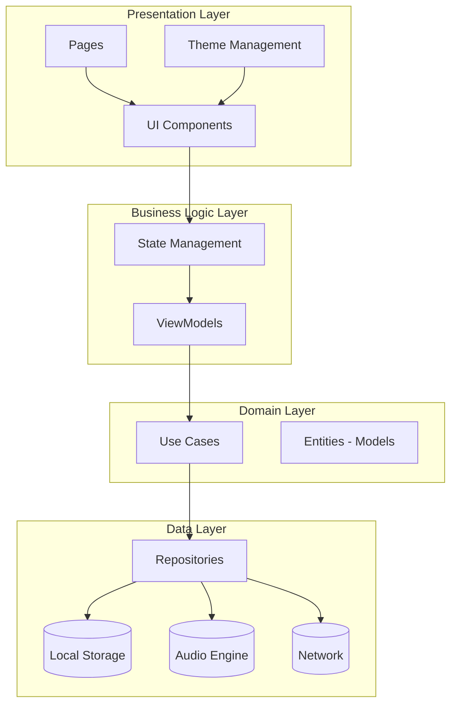
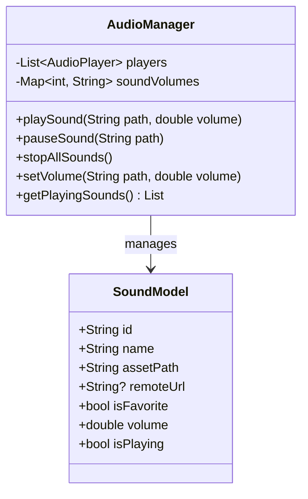
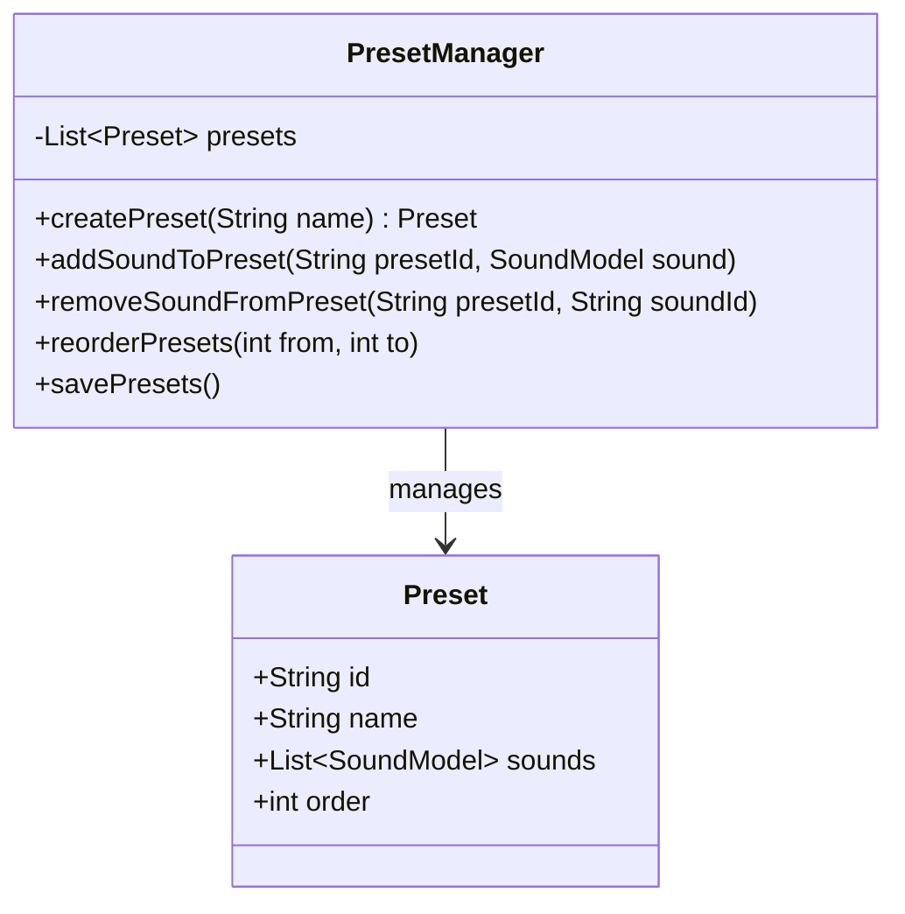
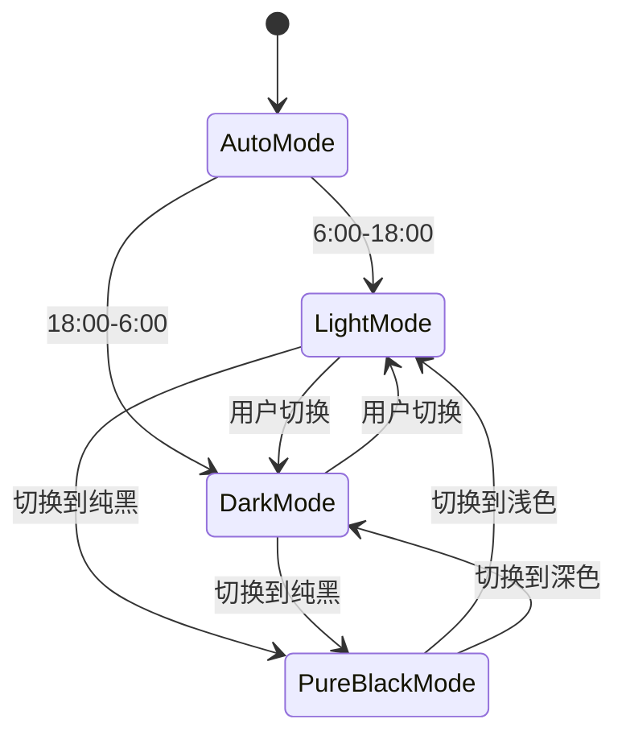
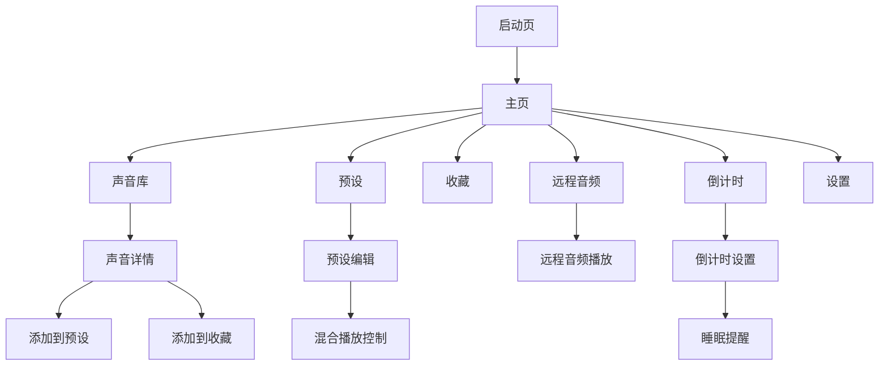

# XMSLEEP Flutter 迁移架构规划

## 1. 项目概述

将 XMSLEEP Android 应用（Kotlin + Jetpack Compose）重写为 Flutter 应用，保持原有功能并优化用户体验。

### 1.1 核心功能

- **白噪音播放**: 16种内置声音 + 远程音频
- **预设管理**: 3个预设，每个最多10个声音混合
- **收藏功能**: 用户收藏的声音管理
- **倒计时**: 睡眠定时器功能
- **主题系统**: 浅色/深色/Auto/纯黑
- **动态颜色**: 基于壁纸提取主题色

### 1.2 技术栈对比

| 原始 (Android) | Flutter |
|---------------|---------|
| Kotlin | Dart |
| Jetpack Compose | Flutter Widgets |
| Material3 | Material3 / Cupertino |
| Lottie | lottie_flutter |
| Coil | cached_network_image |
| AudioManager | just_audio / audioplayers |
| PreferencesManager | shared_preferences / hive |

---

## 2. 项目架构

采用 **BLoC 模式** + **Repository** 的清晰分层架构：



---

## 3. 目录结构

```
lib/
├── core/                      # 核心功能模块
│   ├── audio/                 # 音频播放引擎
│   │   ├── audio_player.dart
│   │   ├── audio_manager.dart
│   │   └── models/
│   │       ├── sound_model.dart
│   │       └── playlist_model.dart
│   ├── storage/               # 本地存储
│   │   ├── preferences_manager.dart
│   │   └── database/
│   ├── theme/                 # 主题管理
│   │   ├── theme_service.dart
│   │   ├── color_extractor.dart
│   │   └── theme_constants.dart
│   └── network/               # 网络模块
│       ├── api_service.dart
│       └── remote_audio_repository.dart
├── features/                  # 功能模块
│   ├── home/                  # 首页
│   │   ├── home_page.dart
│   │   ├── home_bloc.dart
│   │   ├── home_event.dart
│   │   └── home_state.dart
│   ├── sounds/                # 声音库
│   │   ├── sounds_page.dart
│   │   ├── sounds_cubit.dart
│   │   └── sounds_list.dart
│   ├── preset/                # 预设管理
│   │   ├── preset_page.dart
│   │   ├── preset_cubit.dart
│   │   └── preset_model.dart
│   ├── favorites/             # 收藏
│   │   ├── favorites_page.dart
│   │   └── favorites_cubit.dart
│   ├── remote/                # 远程音频
│   │   ├── remote_page.dart
│   │   ├── remote_cubit.dart
│   │   └── remote_model.dart
│   ├── timer/                 # 倒计时
│   │   ├── timer_page.dart
│   │   └── timer_cubit.dart
│   └── settings/              # 设置
│       ├── settings_page.dart
│       └── settings_cubit.dart
├── shared/                    # 共享组件
│   ├── widgets/
│   │   ├── sound_card.dart
│   │   ├── volume_slider.dart
│   │   ├── preset_card.dart
│   │   └── animated_background.dart
│   ├── utils/
│   │   ├── constants.dart
│   │   ├── extensions.dart
│   │   └── helpers.dart
│   └── lottie/
│       └── lottie_animations.dart
├── injection/                 # 依赖注入
│   └── dependency_injection.dart
├── config/                    # 配置
│   ├── app_config.dart
│   └── assets_config.dart
└── main.dart                  # 入口文件
```

---

## 4. 核心模块设计

### 4.1 音频播放模块



### 4.2 预设系统



### 4.3 主题系统



---

## 5. 依赖配置

查看已配置的 `pubspec.yaml`，主要依赖：

- **状态管理**: bloc / flutter_bloc
- **音频播放**: audioplayers / just_audio
- **动画**: lottie_flutter
- **图片缓存**: cached_network_image
- **本地存储**: shared_preferences / hive
- **网络请求**: dio
- **UI组件**: flutter_material_color_picker / flex_color_picker

---

## 6. 页面流程



---

## 7. 迁移优先级

### Phase 1: 基础架构 ✅
- [x] 项目初始化
- [x] 依赖配置
- [ ] 目录结构创建
- [ ] 主题系统框架

### Phase 2: 核心功能 🎯
- [ ] 音频播放引擎
- [ ] 16种内置白噪音
- [ ] 音量控制
- [ ] 预设系统

### Phase 3: 用户界面 📱
- [ ] 主页布局
- [ ] 声音库页面
- [ ] 预设管理页面
- [ ] 收藏功能
- [ ] 远程音频页面
- [ ] 倒计时页面
- [ ] 设置页面

### Phase 4: 高级功能 ✨
- [ ] 动态颜色提取
- [ ] Lottie动画集成
- [ ] 动画WebP支持
- [ ] 缓存管理
- [ ] 软件更新检查

### Phase 5: 优化和测试 🧪
- [ ] 性能优化
- [ ] 深色模式完善
- [ ] 纯黑模式
- [ ] 国际化支持
- [ ] 测试覆盖

---

## 8. 关键实现细节

### 8.1 声音文件结构
```
assets/sounds/
├── morning_coffee.wav
├── windmill.wav
├── rain_on_umbrella.wav
├── typewriter.wav
├── clock.wav
├── rowing.wav
├── forest_birds.wav
├── drifting.wav
├── thunder.wav
├── campfire.wav
├── snow_hiking.wav
├── wind_blowing.wav
├── heavy_rain.wav
├── library.wav
├── keyboard.wav
└── office.wav
```

### 8.2 数据模型示例

```dart
// Sound Model
class Sound {
  final String id;
  final String name;
  final String assetPath;
  final String? remoteUrl;
  final SoundCategory category;
  final bool isFavorite;
  final double volume;
  
  Sound({
    required this.id,
    required this.name,
    required this.assetPath,
    this.remoteUrl,
    required this.category,
    this.isFavorite = false,
    this.volume = 1.0,
  });
}

// Preset Model
class Preset {
  final String id;
  final String name;
  final List<PresetSound> sounds;
  final int sortOrder;
  
  Preset({
    required this.id,
    required this.name,
    required this.sounds,
    required this.sortOrder,
  });
}
```

---

## 9. 总结

这个迁移计划涵盖了从架构设计到具体实现的完整方案。关键要点：

1. **架构清晰**: 采用 BLoC + Repository 模式，易于维护和测试
2. **模块化**: 功能模块独立，便于团队协作
3. **性能优先**: 使用合适的音频库和缓存策略
4. **体验一致**: 保持原有功能，优化 UI/UX
5. **可扩展**: 预留了远程音频和插件扩展能力

建议按照优先级逐步实现，先完成核心音频播放功能，再逐步完善UI和高级特性。
